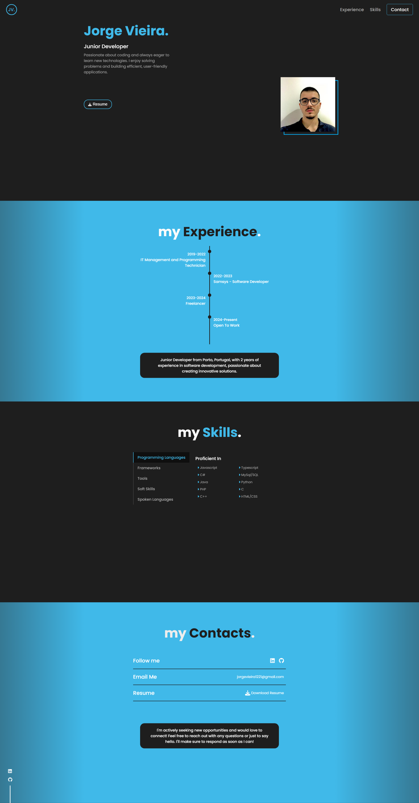

# Portofolio

## About Me

Hi, I’m **Jorge Vieira** – a passionate **Junior Developer** from Porto. I am continuously learning and growing in the world of web development. I love experimenting with new technologies and frameworks, particularly **React**, and I'm constantly trying to improve my skills by building projects like this one.

Feel free to explore the project, leave feedback, or connect with me on [GitHub](https://github.com/JorgeFMVieira).

## Technologies Used

- **React** – A JavaScript library for building user interfaces.
- **TypeScript** – A superset of JavaScript that adds static types.
- **npm** – Node Package Manager, used for managing project dependencies.

## Overview

This project was bootstrapped with [Create React App](https://github.com/facebook/create-react-app). The goal of this project is to build and experiment with React, implementing various features and practices to enhance my skills as a developer.

## Contributing

Feel free to fork this project, make improvements, or create issues for feedback. Contributions are always welcome!



## Available Scripts

In the project directory, you can run the following scripts:

### `npm start`

Runs the app in development mode.\
Open [http://localhost:3000](http://localhost:3000) to view it in the browser.

The page will automatically reload when you make changes, and you’ll see any lint errors in the console.

### `npm test`

Launches the test runner in interactive watch mode.\
Refer to the section about [running tests](https://facebook.github.io/create-react-app/docs/running-tests) for more information.

### `npm run build`

Builds the app for production to the `build` folder.\
It optimizes the build for the best performance and minifies the code. The filenames will include hashes for cache management. Your app is now ready for deployment.

For deployment instructions, check out the [deployment guide](https://facebook.github.io/create-react-app/docs/deployment).

### `npm run eject`

**Note: This is a one-way operation. Once you `eject`, you can’t go back!**

If you wish to customize the build tools and configurations (such as webpack, Babel, ESLint, etc.), you can run this command. It will copy all configurations into your project, giving you full control, but you’ll be responsible for managing these files manually.

You do not need to `eject` unless you need to customize the setup significantly. Most small or medium-sized projects don’t need this step.

## Getting Started

### Prerequisites

- Node.js (with npm) installed on your system.

### Installation

1. Clone this repository:
   ```bash
   git clone <repository-url>

2. Navigate to the project folder:
    cd <project-folder>

3. Install the project dependencies:
    npm install

### Running the App

To start the development server and run the app locally, use:
    npm start
    Your app will be available at http://localhost:3000.